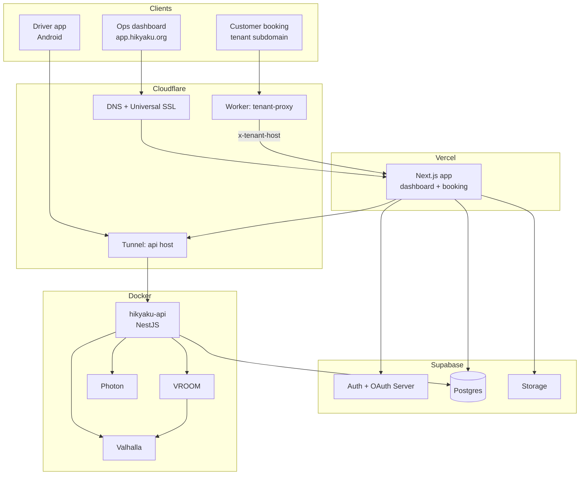
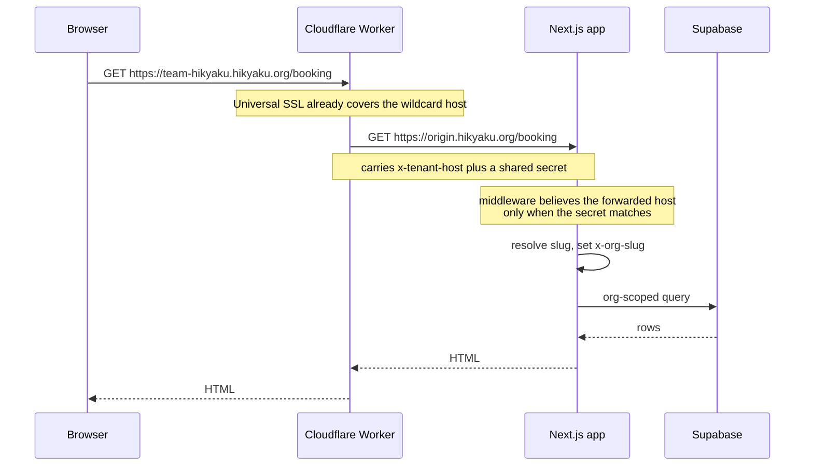

# Architecture

Hikyaku is a set of repositories that run on four different platforms and most of the confusing parts of the codebase are consequences of that split. 
This page maps what runs where and how each request is handled. Hosting your own instance is time consuming 
and requires significant infrastructure management and resources.

Read this before the installation guides and it will make the setup steps look deliberate instead of arbitrary.

## The shape

## Where the code runs

| Repository | Runs on | Owns |
|---|---|---|
| `hikyaku` | Vercel | The dashboard, the customer booking site, and all Supabase-backed reads and writes from the browser or server components |
| `hikyaku-api` | Docker host | Routing, optimisation, payments, card issuing, geocoding, invitations, mail, and scheduled jobs |
| `hikyaku-mobile` | Android | The driver app, sharing one Kotlin Multiplatform logic and UI layer |
| `hikyaku-n8n` | n8n | Delivery-status triggers and package/customer lookups as n8n nodes |

## Multi-tenancy: two addressing modes

A tenant is an organisation identified by a slug. There are two ways to address one, and they are not interchangeable:

- **The dashboard is path-based** — `/orgs/<slug>/dashboard`, served on the application host.
- **The booking site is subdomain-based** — `<slug>.<root-domain>/booking`.

The booking site is the *only* thing served on a tenant subdomain. Any other path on a tenant host redirects to the apex.

When both are present, **the path wins over the host**. Middleware resolves the active slug and passes it downstream as an `x-org-slug` request header; everything below that point reads the header rather than re-parsing the URL.

## Tenant Request

This is the least obvious path in the system and it involves a Cloudflare Worker that exists for a single specific reason.

### Why the Worker exists

The hosting platform cannot issue a certificate for a wildcard tenant host, because that requires the platform to own the domain's nameservers via a DNS-01 challenge. The nameservers have to stay on Cloudflare so the API tunnel keeps working. 
Without the Worker, Cloudflare terminates the browser's TLS correctly and then fails the handshake to the origin and users will see as a Cloudflare **error 525**.

The Worker resolves this by forwarding to an origin hostname the platform *does* hold a certificate for, carrying the real tenant hostname in a header instead of in `Host`.

Two consequences worth internalising:

1. **The shared secret is a security boundary.** The origin host is publicly reachable. If the secret is missing or mismatched, any caller could set `x-tenant-host` themselves and read another organisation's booking data. The middleware ignores the forwarded host unless the secret matches.
2. **Infrastructure hosts must be excluded from the Worker route.** The route pattern matches every subdomain, so the application and API hosts are excluded explicitly. Forgetting this puts a proxy hop in front of the API.

Moving off the current host is a one-line change to the Worker's origin variable, because Cloudflare owns tenant DNS, TLS and routing regardless.

## Data: Supabase is the system of record

The operational database is a single Supabase project. Both the Next.js app and the NestJS API read and write it, but they reach it differently and with different privileges:

| Caller | Path | Privilege |
|---|---|---|
| Browser and server components | Supabase client libraries | Row-level security applies |
| `hikyaku-api` | Direct Postgres connection over TypeORM | Service role, no Row-level security |
| n8n nodes | PostgREST | Row-level security applies |

The service-role key must never appear in the web application. It bypasses every access-control policy in the database.

**The schema is Supabase-owned.** The API connects with TypeORM but does not manage the schema: `synchronize` is off and migrations do not run on boot. Treat the checked-in SQL bootstrap files as canonical and keep the application's generated type layer aligned with them.

Which Supabase services are in play:

- **Auth** — email and password, Google sign-in via ID token, and WebAuthn MFA.
- **Auth OAuth Server** — Hikyaku itself acts as an identity provider. This is what lets a tenant connect their n8n instance to their Hikyaku account without ever handing over a password.
- **Postgres** — the operational tables with row-level security enabled on every one.
- **Storage** — proof of delivery, vehicle and maintenance photos, and app images. All buckets are private except avatars.
- **Realtime** — package status changes and driver location updates.
- **Vault** — encrypted storage for third-party connection tokens.

Two things are deliberately *not* used: there are no Edge Functions, and scheduled work does not run in the database. Scheduling lives in the NestJS API instead. If you are looking for a cron job, look there.

## The spatial stack

Route planning and geocoding run as three containers on the same private Docker network as the API:

| Service | Role |
|---|---|
| **Valhalla** | Routing, distance and time matrices, elevation, time zones |
| **VROOM** | The vehicle-routing solver. It calls Valhalla as its router |
| **Photon** | Geocoding and address search |

Two properties of this setup matter more than the services themselves:

- **They publish no host ports.** They are reachable only by containers on the shared network, resolved by service name. They are not on localhost, the LAN, or the internet.
- **They have no authentication whatsoever.** Anyone who can reach the port can use them. That is acceptable only because of the point above. 

The API and spatial stacks are separate Compose projects on purpose, so the API can be redeployed without rebuilding the slow spatial tiles. Expect the first Valhalla boot to take a long time: it downloads a regional extract and builds routing tiles before it answers anything, and VROOM and the API will error until it finishes.

## Integrations

**n8n.** A community node package installed into the tenant's own n8n. The trigger holds a Realtime WebSocket per *activated workflow*, not per execution, which is the number that counts against connection limits. Lookups go through PostgREST with the user's own token, so row-level security is the access boundary.

**Mobile.** The app is not compiled against a fixed backend. On first run it fetches its configuration from an environment endpoint on the web app, which returns the Supabase URL, the anonymous key, and the API base URL. This is what allows the app to point at a self-hosted Hikyaku instance instead of the default one.

## Where to start reading

1. **The sidebar component** in the web app — it is the fastest map of the business domains: Packages, Customers, Driver Shifts, Fleet, Service, Settings.
2. **The middleware** — auth refresh, tenant resolution, and the `x-org-slug` header all originate there.
3. **The API's root module** — one import per business capability, which doubles as a table of contents for the backend.
4. **The SQL bootstrap files** — the canonical schema, roles, and seed data, in that order.
5. **[Access Control](./security-and-access.mdx)** — the permission model both the database and the API enforce.

Then work through [Supabase Setup](./installation/supabase-setup.mdx) and stand up a local environment.
