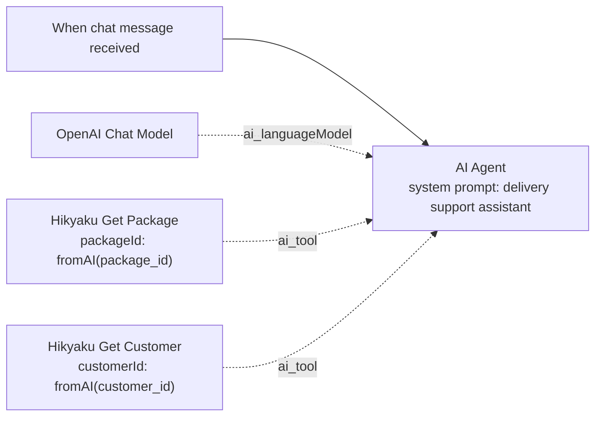
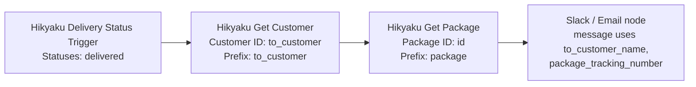
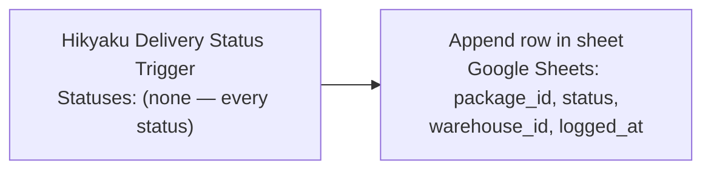
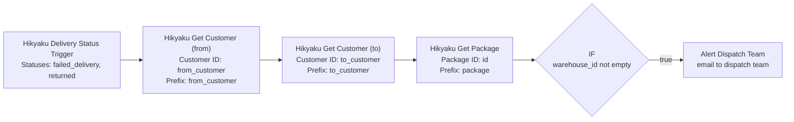

# n8n Integration

[`hikyaku-n8n`](https://github.com/hikyakuorg/hikyaku-n8n) (published to npm as [`n8n-nodes-hikyaku`](https://www.npmjs.com/package/n8n-nodes-hikyaku)) is a community node package that brings Hikyaku into your n8n workflows: react to delivery status changes as they happen, and enrich any workflow with customer and package data.

See [Architecture → Where the code runs](../architecture#where-the-code-runs) and [Architecture → Integrations](../architecture#integrations) for how this plugs into the rest of the system — this page is the setup and usage guide.

## What You Get

The package ships three nodes and one credential type:

| Node | Type | What it does |
|---|---|---|
| **Hikyaku Delivery Status Trigger** | Trigger | Starts the workflow the moment a package's delivery status changes. Optionally filter to specific statuses. |
| **Hikyaku Get Customer** | Action | Looks up a customer by ID and adds their name, phone, and email to the item. |
| **Hikyaku Get Package** | Action | Looks up a package by ID and adds its dimensions, tracking number, and current status to the item. |

All three are also marked `usableAsTool`, so you can hand them to an **AI Agent** node instead of wiring them into a fixed sequence. See [Example: an AI agent that answers tracking questions](#example-an-ai-agent-that-answers-tracking-questions) below.

## Prerequisites

- **Node.js 22 or newer** on the n8n host. The trigger node uses the `WebSocket` client built into Node (stable from v22.5) to hold its Realtime connection open. On an older Node version it fails activation with a clear error rather than crashing.
- **Community node installation enabled** on your n8n instance, and an **Owner or Admin** role to install one.
- **A Hikyaku organisation account.**

:::caution[Self-hosted Hikyaku]
The published `n8n-nodes-hikyaku` package is pre-configured to connect to the **hosted** Hikyaku instance (`app.hikyaku.org`) — the Supabase project URL and OAuth client ID are baked into the build. If you're self-hosting Hikyaku, installing the npm package as-is will connect your n8n workflows to the hosted instance's data, not yours.

Self-hosted users need to build their own copy against their own instance instead: complete [Supabase Setup → Enable the OAuth Server](../self-hosting/supabase#enable-the-oauth-server) first, then follow the "Setup" section of the [`hikyaku-n8n` README](https://github.com/hikyakuorg/hikyaku-n8n#setup) to set your own Supabase URL, anon key, and OAuth client ID before building and installing.
:::

## Install the Node

1. In your n8n instance, go to **Settings → Community Nodes → Install**.
2. Enter the package name: `n8n-nodes-hikyaku`.
3. Check **"I understand the risks of installing unverified code from a public source"** and click **Install**.

:::note
Community nodes are unverified third-party code by n8n's own definition, and GUI installation applies to self-hosted n8n. If you're on n8n Cloud and don't see the Install option, check whether your plan allows unverified community packages.
:::

## Connect Your Account

1. Add a **Hikyaku Delivery Status Trigger** (or either of the other two nodes) to a workflow.
2. Under **Create workflow**, select **Create Credentials** → **Hikyaku OAuth2 API**.

3. Click **Connect**, log in to Hikyaku, and approve the consent screen.

n8n stores the resulting token and refreshes it automatically. The token is a normal Supabase session scoped to your organisation, so every lookup these nodes make is subject to the same row-level security as the dashboard.

## Revoke Access

If you no longer want n8n (or any other integration) reading your Hikyaku data, you can revoke its access at any time without changing your password.

1. In Hikyaku, go to **Settings → Connected Apps**.
2. Find the app in the list (e.g. **n8n**) and click **Revoke**.

Revoking breaks any Hikyaku nodes still using that connection — the trigger stops firing and lookups start failing. To restore the integration, delete the old **Hikyaku OAuth2 API** credential in n8n and create a new one following [Connect Your Account](#connect-your-account) above.

## Node References

### Hikyaku Delivery Status Trigger

Opens one Supabase Realtime connection per **activated** workflow, and fires the workflow the moment a package's delivery status changes. The node is designed to be resilient to connection drops, and will replay any missed events once it reconnects.

- **Statuses**: multi-select, populated live from your `package_status` table. Leave empty to trigger on every status change.
- **Output**: `id`, `from_customer`, `to_customer`, `warehouse_id`, `current_status` for the package whose status just changed.
- If the connection drops, the node reconnects with backoff (5 attempts by default, capped at 30s apart) and replays anything it missed once resubscribed.

### Hikyaku Get Customer

- **Customer ID**:  defaults to `{{$json["from_customer"]}}`, so it drops in directly after the trigger.
- **Output Field Prefix**:  defaults to `customer`. Adds `<prefix>_name`, `<prefix>_phone_number`, `<prefix>_email` to the item.
- Add the node twice with different prefixes (e.g. `from_customer` and `to_customer`) to enrich both sides of a delivery in one workflow.

### Hikyaku Get Package

- **Package ID** — defaults to `{{$json["id"]}}`.
- **Output Field Prefix** — defaults to `package`. Adds `<prefix>_weight_kg`, `<prefix>_height_cm`, `<prefix>_length_cm`, `<prefix>_tracking_number`, `<prefix>_status` to the item.

## Example Workflows

Each example below is also available as an importable `.json` file in [`hikyaku-n8n/examples`](https://github.com/HikyakuOrg/hikyaku-n8n/tree/main/examples). Import via **Workflows → Overflow Menu → Import from file** in n8n, then open each Hikyaku node and reconnect your own **Hikyaku OAuth2 API** credential. See [README](https://github.com/HikyakuOrg/hikyaku-n8n/blob/main/examples/README.md) for the full list and setup notes.

### Example: an AI agent that answers tracking questions

Because **Hikyaku Get Customer** and **Hikyaku Get Package** are both `usableAsTool`, you can skip wiring them into a fixed chain and instead attach them directly to an **AI Agent** node's tool list. Give the agent a prompt like "look up package and customer details to answer delivery questions," and it decides when to call each lookup based on the conversation. This is useful for a support-chatbot workflow that answers "where's my package" questions without a human touching Hikyaku directly.

1. **When chat message received** (Chat Trigger): starts the workflow when a user sends a message.
2. **AI Agent**: system prompt instructs it to look up real data before answering, and to ask for a package/customer ID if it doesn't have one.
3. **OpenAI Chat Model** (or any other Chat Model node): wired as the agent's language model.
4. **Hikyaku Get Package** and **Hikyaku Get Customer**: wired as tools, with `packageId`/`customerId` bound via `$fromAI(...)` so the agent supplies the argument itself.

### Example: notify a customer when their package is delivered

1. **Hikyaku Delivery Status Trigger**: set **Statuses** to `delivered` only.
2. **Hikyaku Get Customer**: Customer ID `{{$json["to_customer"]}}`, prefix `to_customer`.
3. **Hikyaku Get Package**: Package ID `{{$json["id"]}}`, prefix `package`.
4. A **Slack**, **Email**, or **Twilio** node: compose the message from `{{$json["to_customer_name"]}}` and `{{$json["package_tracking_number"]}}`. The downloadable version below uses a generic **Send Email** node.

### Example: log every status change for reporting

1. **Hikyaku Delivery Status Trigger**: leave **Statuses** empty so every change fires.
2. A **Google Sheets** (Append Row) or **Postgres** (Insert) node: write `id`, `current_status`, `warehouse_id`, and n8n's own execution timestamp.

This gives you a running audit trail of every status transition outside of Hikyaku itself, useful for dashboards or SLA reporting tools that don't talk to Hikyaku directly.

### Example: escalate failed deliveries to dispatch

1. **Hikyaku Delivery Status Trigger**: set **Statuses** to whatever your exception states are (e.g. `failed_delivery`, `returned`).
2. **Hikyaku Get Customer** (twice, prefixed `from_customer` and `to_customer`) and **Hikyaku Get Package**: pull in full context.
3. An **IF** node: branch on anything you need (time of day, warehouse, etc.) — the downloadable version below checks that `warehouse_id` is set as a placeholder rule.
4. A **Slack** or **email** node addressed to the dispatch team, with the enriched fields in the message.

## Getting Help

- **Issues and source** — [github.com/hikyakuorg/hikyaku-n8n](https://github.com/hikyakuorg/hikyaku-n8n)
